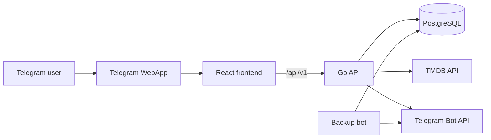

# KinoKrug

[](https://github.com/kestfor/movies/actions/workflows/ci.yml)
[](LICENSE)

KinoKrug is a Telegram WebApp for discovering, rating, and discussing movies and TV series with friends.

## What it does

- Searches movies and series through TMDB.
- Provides discovery and personalized recommendation feeds.
- Saves titles to a personal **Want to watch** list.
- Finds titles that you and selected friends all want to watch.
- Rates titles by configurable criteria and calculates circle averages.
- Supports threaded comments, friend requests, activity feeds, and notifications.
- Tracks achievements, XP, levels, and a friends leaderboard.
- Runs scheduled PostgreSQL backups with optional Telegram delivery.

The interface is mobile-first and follows Telegram WebApp interaction patterns.

## Stack

| Area | Technologies |
| --- | --- |
| Frontend | React 18, TypeScript, Vite, TanStack Query |
| Backend | Go, Gin, pgx, sqlc |
| Data | PostgreSQL 17, tern migrations |
| Integrations | Telegram WebApp, Telegram Bot API, TMDB |
| Delivery | Docker Compose, GitHub Actions, Coolify |

## Architecture



The backend keeps protocol handling, business rules, and persistence in separate HTTP, usecase, and repository layers. TMDB data is snapshotted lazily when a title first becomes part of persisted user activity.

## Quick start with Docker

Requirements:

- Docker with Compose v2;
- a Telegram bot token;
- a TMDB API token.

```bash
cp .env.example .env
# Add TG_BOT_TOKEN and TMDB_API_TOKEN to .env
docker compose up -d --build
```

The frontend is available at [http://localhost:3000](http://localhost:3000). Most application routes require valid Telegram `initData`; there is no development authentication bypass.

Stop the stack with:

```bash
docker compose down
```

PostgreSQL data is kept in the `postgres_data` Docker volume.

## Configuration

Copy [`.env.example`](.env.example) to `.env` and adjust it locally. Important values:

| Variable | Purpose |
| --- | --- |
| `TG_BOT_TOKEN` | Telegram authentication and bot integration |
| `TMDB_API_TOKEN` | TMDB API access |
| `TMDB_BASE_URL` | TMDB API base URL |
| `TMDB_LANGUAGE` | TMDB response language |
| `POSTGRES_*` | Local Compose database credentials |
| `VITE_API_BASE_URL` | Frontend API base path at build time |
| `BACKUP_ENABLED` | Enables the backup bot |
| `BACKUP_ADMIN_CHAT_IDS` | Telegram recipients for backup files |

Never commit `.env`, API tokens, webhook URLs, database dumps, or production credentials.

## Local development

### Backend

Requirements: Go 1.26, PostgreSQL when running the service, tern, and sqlc 1.30.

```bash
cd backend
go mod download
go test ./...
go run ./cmd/api
```

The API reads `DATABASE_URL`, `BOT_TOKEN`, and `TMDB_API_TOKEN` from the environment. Migrations can be applied from the repository root:

```bash
make migrate
```

### Frontend

Requirements: Node.js 24 and npm.

```bash
npm --prefix frontend ci
npm --prefix frontend run dev
```

Vite serves the development UI and uses `VITE_API_BASE_URL` for API requests.

## Checks and code generation

Run the complete non-Docker validation suite:

```bash
make check
```

Or run checks individually:

```bash
make test-backend
make test-frontend
make lint-frontend
make build-frontend
make check-generated
```

After changing SQL under `backend/repo/postgres/queries`, regenerate sqlc output:

```bash
make generate
```

Do not edit `backend/internal/repo/postgres/gen` by hand.

## Repository layout

```text
frontend/src/pages                    Application pages
frontend/src/components               Reusable UI components
frontend/src/api                      HTTP client
backend/cmd                           Executables
backend/internal/domain               Domain models
backend/internal/usecase              Business rules
backend/internal/transport/http       Router and HTTP handlers
backend/internal/repo/postgres        PostgreSQL repositories
backend/repo/postgres/queries         sqlc query sources
backend/migrations                    tern migrations
docs                                  Product and API documentation
```

## Documentation

- [HTTP API](docs/api.md)
- [Achievement catalog](backend/internal/usecase/achievements/CATALOG.md)
- [Contributing](CONTRIBUTING.md)

## Deployment

GitHub protects `main` with a required pull request and CI quality gate. After a squash merge, the resulting push to `main` triggers the existing Coolify Docker Compose deployment.

Achievement backfill is no longer part of normal startup. It remains available for manual recovery of lifetime achievements:

```bash
docker compose --profile maintenance run --rm achievements-backfill
```

Achievements with the `since_introduction` policy are always excluded from this command.

Production tokens, webhook endpoints, and Coolify resource settings live outside the repository.

## License

Licensed under the [Apache License 2.0](LICENSE).
